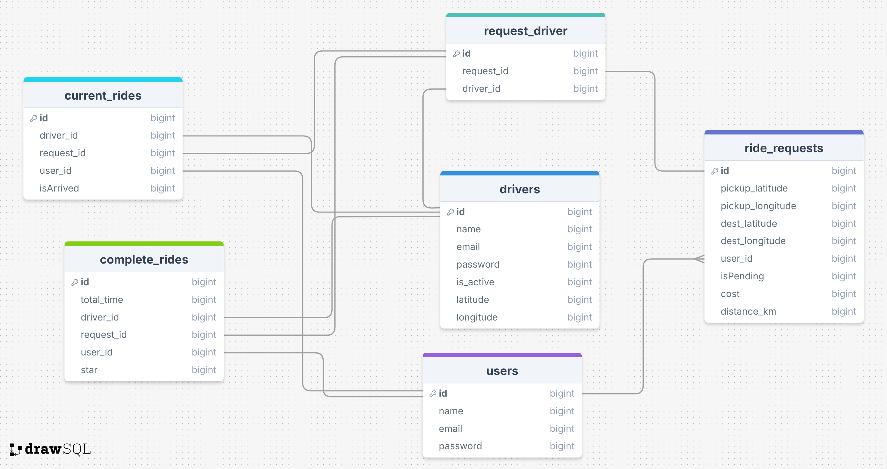

<div style="direction: rtl">

**SnappAPI – سیستم درخواست سفر آنلاین 🚖**  

#### دیاگرام عملکرد کلی برنامه:


#### EER diagram پروژه:


#### SQL tables پروژه:


SnappAPI یک سیستم درخواست تاکسی آنلاین است که با استفاده از Laravel 12 توسعه داده شده است. این پروژه امکان درخواست سفر، مدیریت وضعیت سفر و تعامل میان کاربران و رانندگان را فراهم می‌کند.

---

### 📌 **عملکرد کلی پروژه**  
1. **ثبت درخواست سفر**: هر کاربر می‌تواند با استفاده از متد `store` درخواست سفر ثبت کند.

2. **پردازش درخواست**: درخواست سفر در یک **Listener** پردازش شده و فاصله‌ی مبدأ و مقصد محاسبه می‌شود. بر اساس این فاصله، **هزینه سفر** نیز محاسبه خواهد شد.

3. **برادکست به رانندگان**: اطلاعات سفر (مبدا، مقصد، فاصله و قیمت) برای نزدیک‌ترین رانندگان در دسترس، روی **کانال** `**driver**` برادکست می‌شود.

4. **پذیرش درخواست توسط راننده**: در صورتی که یک راننده درخواست را با متد `accept` بپذیرد، اطلاعات راننده و درخواست، روی **کانال** `**users**` برادکست می‌شود.

5. **پیگیری وضعیت**: کاربر می‌تواند با متد `status` وضعیت فعلی سفر خود را بررسی کند (مثلاً مشاهده کند که آیا راننده رسیده است یا خیر).
6. راننده می‌تواند با متد `status` وضعیت فعلی خود را در سیستم مشاهده کند.

7. **پایان سفر**: پس از اتمام سفر، راننده با متد `complete` پایان سفر را اعلام می‌کند و وضعیت او دوباره به "در دسترس" تغییر می‌یابد.

---

### 🔥 **تکنولوژی‌های استفاده‌شده**
- **Laravel 12** 🚀 (بک‌اند اصلی)
- **Laravel Sanctum** 🔐 (احراز هویت کاربران و رانندگان)
- **Redis** ⚡ (کشینگ و بهینه‌سازی عملکرد)
- **Laravel Reverb** 📡 (برادکست رویدادها و ارتباط زنده)
- **SQLite** 🛢 (پایگاه داده اصلی)
- **l5-swagger** 📜 (مستندسازی API)
- **PhpUnit** 🧪 (تست کیفیت کد)

---

### 🔧 نصب و راه‌اندازی  
۱. پروژه رو کلون کن:  
```bash
git clone git@github.com:pouria-azad/SnappAPI.git
cd SnappAPI
```
۲. وابستگی‌ها رو نصب کن:  
```bash
composer install
npm install
```
۳. فایل **.env** رو تنظیم کن و اطلاعات دیتابیس رو وارد کن:  
```bash
cp .env.example .env
php artisan key:generate
```
۴. دیتابیس رو migrate کن:  
```bash
php artisan migrate --seed
```

۵. داکیومنت هارو بساز کن:  
```bash
php artisan l5-swagger:generate
```

۶. اجرای Redis برای بهینه‌سازی سرعت:

```bash
redis-server
```

۷. پروژه رو اجرا کن:  
```bash
php artisan serve
php artisan reverb:start
php artisan queue:work
```
---
### 🛠 **ویژگی‌های کلیدی**

###### **محدودیت درخواست‌های همزمان**:  
⏳ تا زمانی که درخواست فعلی کاربر پذیرفته نشده یا سفر فعلی او به پایان نرسیده، نمی‌تواند درخواست جدیدی ثبت کند.  
🚗 راننده نیز تا زمانی که در یک سفر باشد، نمی‌تواند درخواست جدیدی را بپذیرد.

###### **بهبود فرآیند پردازش درخواست‌ها**:  
🔄 در حال حاضر، پردازش درخواست سفر از طریق **Listener** انجام می‌شود.  
📊 اطلاعات رانندگانی که درخواست را دریافت کرده‌اند در دیتابیس ذخیره می‌شود. این امکان در آینده وجود دارد که با استفاده از **Job** پردازش درخواست‌ها را مدیریت کنیم و مانند اسنپ، هر چند ثانیه یک‌بار دامنه‌ی جستجوی رانندگان نزدیک را افزایش دهیم.

###### **احراز هویت با توکن**:  
🔑 تمامی کاربران (رانندگان و مسافران) نیاز به احراز هویت با **Sanctum Token** دارند.

###### **مستندسازی کامل**:  
📜 تمامی متدها مستند‌سازی شده و **تست‌های PHPUnit** برای آنها نوشته شده است.

---

### 👨‍💻 **توسعه‌دهنده**  
[**Pouria Azad**](https://www.linkedin.com/in/pouria-azad)  

# مشارکت‌کنندگان  


### 👤 Amir Hossein Taghizadeh
- **Role:** Developer  
- **GitHub:** [Amyrosein](https://github.com/Amyrosein)  

---


📌 این پروژه به‌عنوان یک کلون از **Snapp / Uber** طراحی شده و قابلیت گسترش و شخصی‌سازی دارد.

🚀 **اگر سوالی داشتی یا می‌خوای پروژه رو بهبود بدی، مشارکت در گیت‌هاب آزاد است!** 😎
</div>

## License

This project is licensed under the **GNU General Public License v3.0** - see the [LICENSE](LICENSE) file for details.

